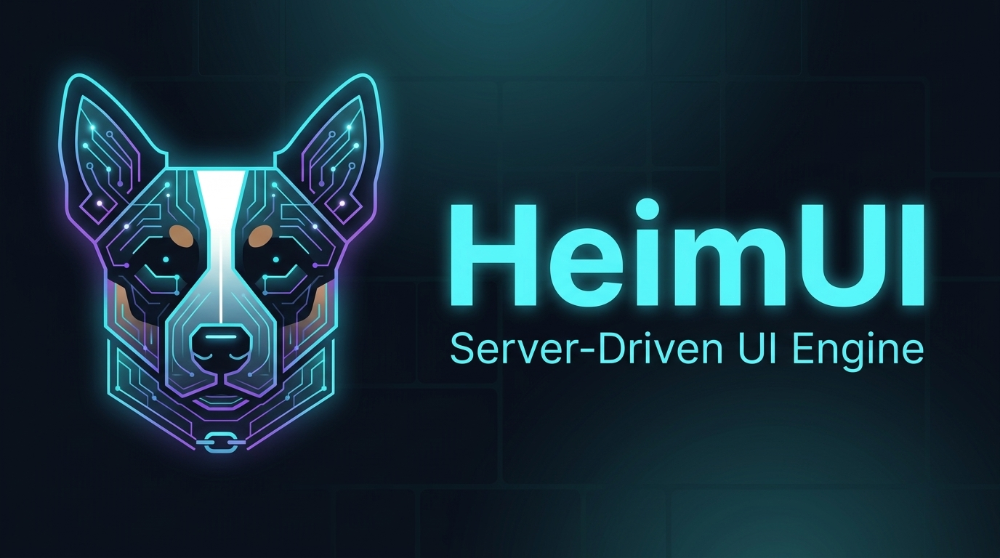
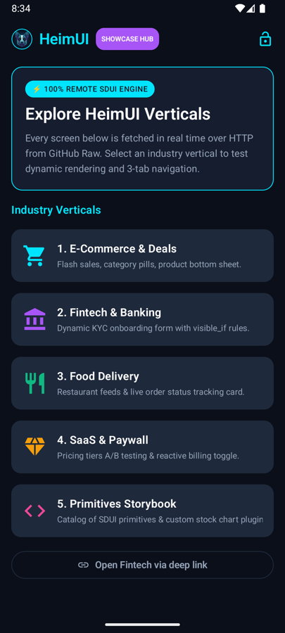
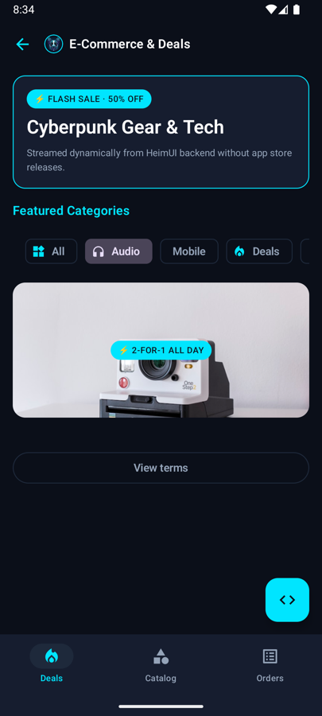
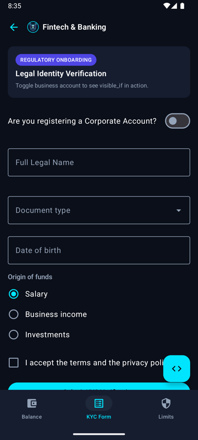
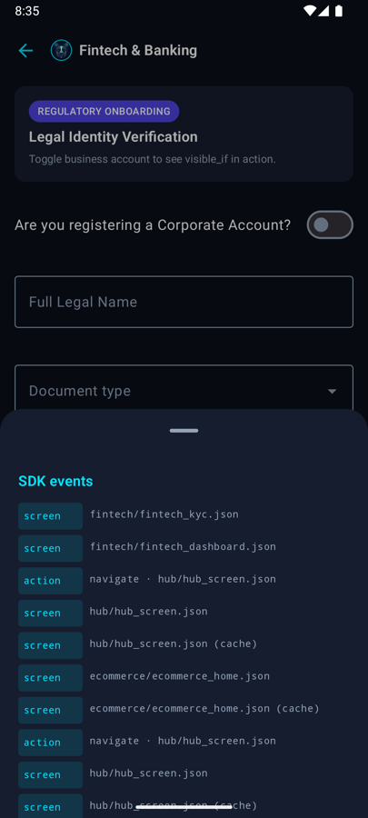

<div align="center">



# HeimUI Demo

**The reference integration for [HeimUI Core](https://heimui.io/sdk/) — Server-Driven UI for Kotlin Multiplatform.**

[](https://kotlinlang.org)
[](https://www.jetbrains.com/compose-multiplatform/)
[](https://android.com)
[](https://apple.com)
[](LICENSE)

**[📖 Documentation](https://heimui.io/sdk/)**

</div>

---

Every screen in this app is fetched over HTTP as JSON and rendered as native Compose. Nothing you
see below is compiled into the binary — change a file under [`sdui/`](sdui/), and the app changes
on the next open.

<div align="center">




</div>

<div align="center">
<sub>Hub · filter chips bound to state · a KYC form with conditional fields · the <code>&lt;/&gt;</code> inspector</sub>
</div>

---

## What this repo is for

It is not a feature tour. It is the app we point people at when they ask *how do I wire this up*,
so it is built the way a production integration should be:

- Screens come from the **SDK's real repository**, so the demo genuinely exercises the cache, ETag
  revalidation, stale-while-revalidate, timeouts and the circuit breaker. A demo that fetches its
  own JSON demonstrates none of that.
- All four **levels of customisation** are wired and verified — see [ARCHITECTURE.md](ARCHITECTURE.md).
- The seams with no pixels (an interceptor refusing a submit, a launcher claiming a scheme) are
  pinned by tests, because they are invisible when they work.

## The five verticals

| Vertical | What it demonstrates |
| :--- | :--- |
| **E-Commerce** | Filter chips bound to form state, a promotional hero, a product sheet whose content is itself SDUI. |
| **Fintech** | A KYC form with `visible_if`, `select`, `date_picker`, `radio_group` and `checkbox` — plus drafts that survive process death. |
| **Food delivery** | Feeds, carousels and an order-tracking card. |
| **SaaS paywall** | Plan comparison and a billing toggle driven entirely by `set_state`, with no round trip. |
| **Storybook** | Every primitive, the brand tokens, and a custom `stock_chart` plugin the SDK has never heard of. |

> **Tip:** the `</>` button on any screen opens a panel showing the SDK events that screen produced
> and the raw JSON behind it. It is the fastest way to see what the engine is doing — and it is
> about forty lines of app code you can copy.

## Running it

**Requirements:** Android Studio (Ladybug or newer) or IntelliJ IDEA, JDK 17+, and Xcode 16+ for iOS.

```bash
# Android
./gradlew :androidApp:installDebug

# iOS — open in Xcode and run
open iosApp/iosApp.xcodeproj
```

The app talks to static payloads on GitHub Raw, so there is no backend to stand up.

To iterate on payloads locally, serve them and point the app at your machine:

```bash
python3 -m http.server 8080
./gradlew :androidApp:installDebug -PheimuiCore=0.0.1-alpha-1-LOCAL
```

Then set `StaticDemoCatalogRepository.sduiBaseUrl` to `http://10.0.2.2:8080/sdui` — `10.0.2.2` is
the emulator's alias for your host. Plain HTTP reaches debug builds only; release still refuses
cleartext.

## Integrating HeimUI in your own app

Full guide at **[heimui.io/sdk](https://heimui.io/sdk/)**. The
short version:

```kotlin
dependencies {
    implementation("io.heimui:heimui-core:0.0.1-alpha-1")
}
```

```kotlin
// Once, at startup.
HeimUI.initialize(HeimConfig(baseUrl = "https://api.yourcompany.com/sdui"))
```

```kotlin
// Wherever you render a screen. HeimTheme inherits the theme it is wrapped in,
// so server-driven screens look like the rest of your app with nothing to restate.
@Composable
fun HomeRoute(navController: NavController) {
    YourAppTheme {
        HeimTheme {
            HeimScreen(
                screenId = "home",
                onAction = { action ->
                    // HeimUI dispatches NavigateAction and stops — only your app knows its graph.
                    // Everything else (submit_form, dialogs, open_url) it already handled.
                    if (action is NavigateAction) navController.navigate(action.screenId)
                },
            )
        }
    }
}
```

Almost every integration also installs an icon provider, because the SDK ships no icon dependency
of its own:

```kotlin
HeimTheme(iconProvider = YourIconProvider) { … }
```

## What the engine gives you beyond rendering

- **Forward compatibility** — a component type this client has never heard of renders nothing and
  reports itself, instead of breaking the screen around it.
- **Stale-while-revalidate** — the cached screen paints immediately; ETag revalidation makes an
  unchanged screen cost a few hundred bytes.
- **Fails closed** — submissions only reach allow-listed hosts, URLs only open allow-listed
  schemes, and signed payloads are re-verified when read back from cache.
- **Degrades, never blanks** — circuit breaker, timeouts, an emergency bundle, and cached content
  that stays on screen rather than being replaced by an error.

## Repository layout

```
sdui/screens/     the payloads — this is what changes when a screen changes
shared/           the app: domain, data, presentation, design system, integration seams
androidApp/       Android host
iosApp/           iOS host
art/              logo, brand guidelines, screenshots
```

[ARCHITECTURE.md](ARCHITECTURE.md) explains why the app is split this way, and where each of the
four customisation levels lives.

## License

Apache 2.0 — see [LICENSE](LICENSE).
